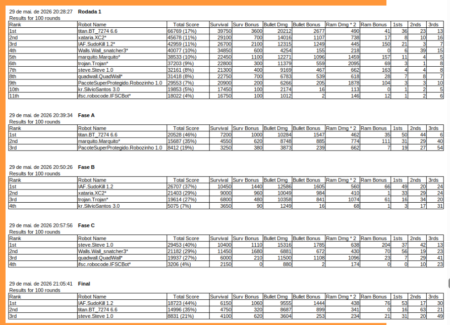
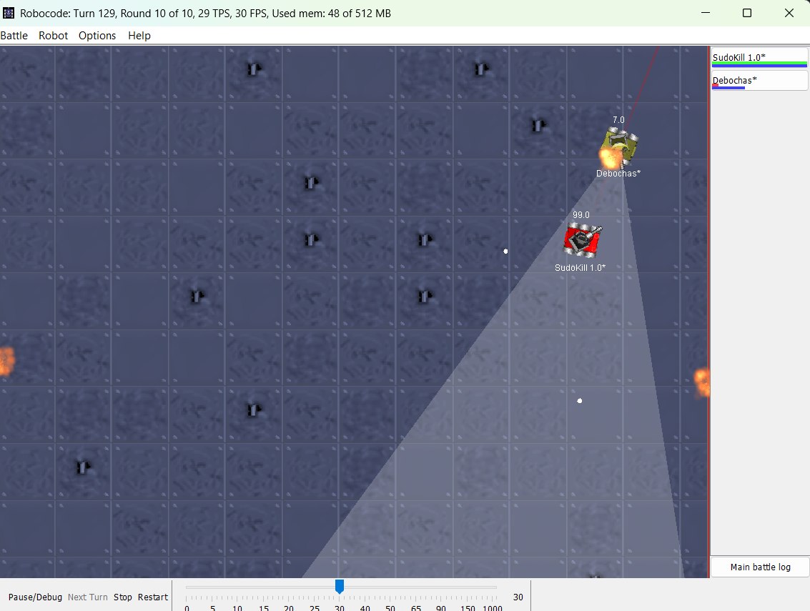
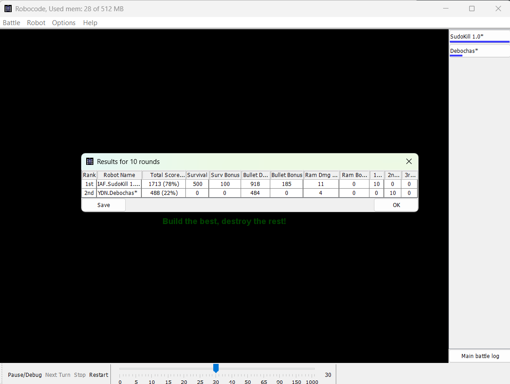

# sudo-kill-robocode-ICO-IFSC

## INTRODUÇÃO
O projeto, proposto na disciplina de Introdução à Computação, teve como objetivo promover o trabalho colaborativo, o aprendizado de programação e o controle versão em trabalhos em grupo. Para isso, o docente propôs a criação de robôs no Robocode para participarem de um duelo entre equipes. 

O Robocode é um ambiente de programação no qual os participantes desenvolvem robôs capazes de competir automaticamente em uma arena virtual. Por meio do código implementado em Java, o robô toma decisões de forma autônoma, definindo seus movimentos, a mira, os disparos e as reações aos adversários.

Nesse contexto, foi utilizado o controle de versão com Git e GitHub, ferramentas essenciais no desenvolvimento de software. Elas permitem registrar e gerenciar alterações no código, facilitando o trabalho em equipe, o acompanhamento das contribuições e a recuperação de versões anteriores. Dessa forma, o uso do controle de versão garantiu mais organização, colaboração e segurança no desenvolvimento do projeto.
No contexto do Robocode, o controle de versão também desempenha um papel importante no acompanhamento da evolução das estratégias implementadas nos robôs, permitindo:

 - Salvar diferentes versões do robô para comparar seu desempenho;
 - Testar novas estratégias sem comprometer versões anteriores;
 - Facilitar o trabalho colaborativo entre os membros da equipe;
 - Identificar quais alterações contribuíram para melhorar ou piorar os resultados obtidos nas batalhas.

Dessa forma, tanto em projetos profissionais quanto em atividades acadêmicas envolvendo o Robocode, o controle de versão contribui para um processo de desenvolvimento mais organizado, seguro e eficiente.

## OBJETIVOS
Os principais objetivos esperados pelo grupo ao desenvolver esse projeto foram:

 - **GANHAR A BATALHA**
 - Aprender os conceitos básicos de programação em Java.
 - Compreender o funcionamento da plataforma Robocode e o desenvolvimento de robôs autônomos.
 - Utilizar o Git para realizar o controle de versão do projeto.
 - Aprender a utilizar o GitHub para armazenar e compartilhar código.
 - Desenvolver habilidades de trabalho em equipe e colaboração em projetos de software.
 - Praticar a resolução de problemas por meio da criação de estratégias para o robô.
 - Aplicar conceitos de lógica de programação e algoritmos em um projeto prático.
 - Acompanhar e documentar a evolução do projeto por meio do histórico de versões.

## DESCRIÇÃO
Inicialmente, foi criado um grupo no WhatsApp para facilitar a comunicação entre as integrantes e a divisão das tarefas. Cada participante ficou responsável por uma área específica do desenvolvimento do robô:

- **Movimentação** - Alyne: anda, desvios e fulgas.
- **Ataque/mira** - Isabelle: atacar, controlar arma e economia de energia.
- **Radar e estrateǵia** - Fabliny: detectar inimigos e tomar decisões.

A partir dessa divisão, cada integrante desenvolveu sua parte do código em arquivos separados, possibilitando um trabalho mais organizado e colaborativo. Entre as principais estratégias implementadas no robô, destacam-se os métodos de:

- Movimentação evasiva;
- Rastreamento inteligente de adversários;
- Troca dinâmica de alvos;
- Radar travado no inimigo detectado;
- Mira preditiva;
- Estratégias de sobrevivência em combate.

Posteriormente, foi criado um repositório no GitHub para integrar as diferentes partes do projeto, permitindo a realização de ajustes, correções e melhorias necessárias para o funcionamento do robô como um todo.

O desenvolvimento do projeto foi conduzido com comunicação clara e objetiva entre as integrantes, buscando constantemente a implementação de novas funcionalidades e o apoio mútuo na resolução de dúvidas. O GitHub foi a principal ferramenta utilizada para o gerenciamento do projeto, permitindo o acompanhamento das alterações realizadas, a visualização das branches e o histórico de commits.

Além disso, o Git foi amplamente utilizado para diversas atividades, tais como:

- Configuração dos usuários para identificação dos autores das alterações;
- Envio e recebimento de atualizações entre os repositórios local e remoto;
- Criação e gerenciamento de commits;
- Integração de branches por meio de merges;
- Visualização do histórico de commits e do estado dos arquivos;
- Clonagem do repositório para diferentes ambientes de desenvolvimento;
- Busca e sincronização de alterações disponíveis no repositório remoto.

Dessa forma, o uso do Git e do GitHub foi essencial para garantir a organização, o controle de versões e a colaboração eficiente entre as integrantes da equipe.

## ESTRUTURA
Durante o desenvolvimento do projeto, foi adotada uma estrutura de controle de versão baseada no Git e no GitHub, permitindo que as integrantes trabalhassem simultaneamente sem comprometer a estabilidade do código principal. O repositório foi criado no GitHub e utilizado como repositório remoto para centralizar todas as alterações realizadas pela equipe.

### Repositório 

O repositório foi organizado para armazenar todo o código-fonte do robô, os arquivos de configuração, o arquivo .jar utilizado para execução no Robocode e a documentação do projeto. Cada integrante trabalhou em sua própria branch, realizando alterações localmente e sincronizando-as com o repositório remoto por meio do Git.

### Branches

Para facilitar a organização do desenvolvimento, foram criadas diferentes branches, cada uma destinada a uma parte específica do projeto:

- **main:** branch principal, responsável por armazenar a versão estável e integrada do robô.
- **ataques:** utilizada para implementar e aperfeiçoar as funcionalidades relacionadas ao ataque, mira e disparos do robô.
- **movimentacoes:** destinada ao desenvolvimento das estratégias de movimentação, desvio de tiros e deslocamento na arena.
- **estilizacao:** utilizada para personalizar aspectos visuais do robô, como cores e aparência.
- **ajustes:** empregada para realizar correções, melhorias de desempenho e refinamento das estratégias implementadas.
- **readme:** criada para elaborar e atualizar a documentação do projeto, incluindo o relatório e o arquivo README.

Essa organização permitiu que diferentes funcionalidades fossem desenvolvidas em paralelo, reduzindo conflitos e facilitando a integração das alterações.

### Commits

Ao longo do desenvolvimento, foram realizados diversos commits para registrar a evolução do projeto. Procurou-se utilizar mensagens objetivas que identificassem claramente a alteração realizada, como "Implementa movimentacao", "Atualiza estratégia", "adiciona funcoes de ataque", "Melhora imprevisibilidade", "Atualiza versão .jar" e "comentario". Embora algumas mensagens pudessem ser mais descritivas, os commits permitiram acompanhar a evolução do robô, identificar responsáveis pelas alterações e recuperar versões anteriores quando necessário.

### Pull Requests e Integração

Após o desenvolvimento das funcionalidades em suas respectivas branches, as alterações foram integradas à branch principal por meio de processos de merge. Durante esse processo, o GitHub foi utilizado para centralizar o código e facilitar a revisão das modificações antes da integração. A utilização de branches e merges permitiu que cada integrante desenvolvesse sua parte do projeto de forma independente, reduzindo conflitos e garantindo que apenas versões testadas fossem incorporadas à branch principal.

A estrutura adotada demonstrou, na prática, como o Git e o GitHub contribuem para a organização, colaboração e rastreabilidade em projetos de desenvolvimento de software, tornando o trabalho em equipe mais eficiente e seguro.

## RESULTADOS

Como resultado, em primeiro ponto de análise,  observou-se que do ponto de vista da programação, já que a divisão de tarefas foi realizada de modo que todos contribuíssem para o código, todos os integrantes aprofundaram seus conhecimentos em Java, colocando em prática conceitos como lógica, estruturas condicionais, laços de repetição que aplicados em uma estratégia baseada em estruturas como esquiva inteligente, rastreamento por radar, alternância de alvos e previsão de trajetória para a construção de um robô autônomo para o Robocode, usando como parâmetro os Robôs Debochas e Mosquitão como evidente no anexo.

Em segundo ponto, o uso do Git e GitHub possibilitaram experiências no uso de repositórios remotos, branches, commits e integração de código em que os principais conflitos encontrados foram: unir os trechos de códigos criados por cada membro da equipe, lidar com conflitos gerados por alterações em arquivos comuns, tornar o comportamento do robô menos previsível, equilibrar estratégias ofensivas - como a identificação e acompanhamento de um único alvo por vez e mira preditiva estimando a posição futura do inimigo com base em sua velocidade e direção de movimento- e defensivas -com a realização lateral dos movimentos  em relação ao inimigo (strafe), altera sua velocidade de forma aleatória e muda de direção periodicamente ou quando o adversário está muito próximo. O que acarretou no aprofundamento do contato com o Git e GitHub, lógica e trabalho em equipe. 

## CONCLUSÃO
Em suma, através do desenvolvimento do robô no Robocode foi possível aplicar na prática os conhecimentos de programação e consolidar conceitos técnicos do Git e do GitHub, essenciais para o gerenciamento de projetos de software. Ademais, o projeto contribuiu para o aprimoramento do pensamento lógico com a criação de estratégias de movimentação, ataque, defesa e também na resolução de conflitos com a divergência de códigos, erros de compilação e trabalho em equipe com a divisão das funções do nosso Robô, o SudoKill. Dessa forma, nota-se que a experiência alcançou os objetivos propostos, não apenas aplicando a teoria, como ficou evidente na Batalha dos Robôs, em sala, com a classificação em primeiro lugar, mas também progredindo em competências interpessoais, fundamentais para a atuação profissional.

## ANEXO

### Relatório de Batalha

O relatório final disponibilizado pelo professor demonstra o desempenho dos robôs e a vitória da equipe sobre as outras equipes da turma.

### Batalha contra o robô Debochas

Momento da batalha contra o robô Debochas, utilizado como referência para o desenvolvimento da estratégia do nosso tanque.

### Vitória contra o Debochas

Registro da vitória obtida pelo nosso robô durante os testes realizados.

